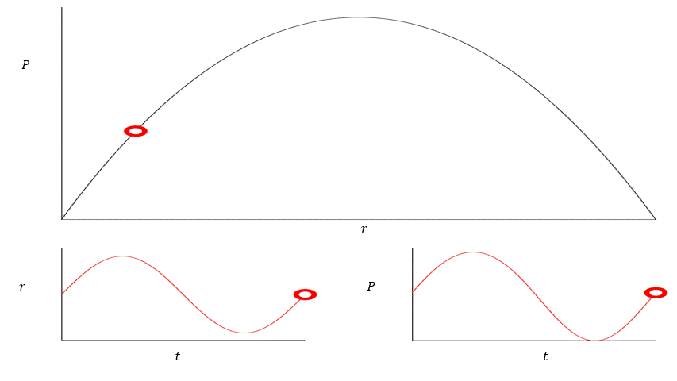
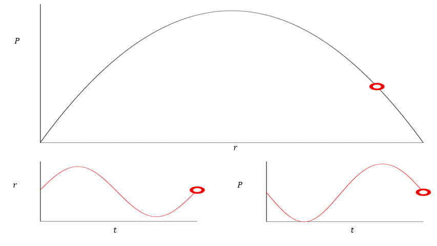
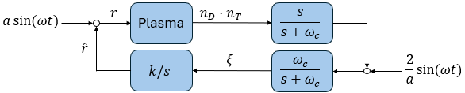

***This file is a summary of all the new knowledge I gain during the internship***

# Motivation for the project

The power output *P* of a tokamak is:
**P ~ n_T * n_D * T**
where:
*n_T* : density of tritium in the core
*n_D* : density of deuterium in the core
*T* : temperature in the core

*First of all, why are there 2 types of gas and not only 1? The reason is that tritium and deuterium react really well together as they have the lowest activation temperature/energy and the highest reaction rate (according to Juan).*

Back to the relation, we can see that it implies that the larger each parameter gets, the more power we can generate. However, as expected, there are ceilings for them.

For *T*, if it is too high, the tokamak would not be able to withstand the heat and be melted down. 
*Then how is T determined/maximized? Separately but simultaneously with the product of the densities (according to Juan).*

For *n_T* and *n_D*, we have Greenwald density limit n_GW -- a theoretical hard limit on total density: **n_GW > n_D + **n_T**

We know that the larger *n_T* and *n_D* are, the more gas particles we have to fuse, allowing us to generate more power. Therefore, we would want **n_T + n_D = n_ref (n_ref < n_GW)**, the largest possible.
*The exact way to indicate n_ref? Based on the certainty of the model. The scientists calculate the GW limit (I do not know the process) and give the result and certainty to the engineers. Based on the numbers, the engineer will choose a safe reference number to construct the reactor (according to Juan).*

However, *P* is dependant on n_T * n_D so we need it to be at its maximum in order for us to generate the most power
We have **n_T * n_D = n_T * (n_ref - n_T) = n_D * (n_ ref - n_ D)** => **(n_T * n_D) max** if **n_T = n_D = 0.5 * n_ref**

# Execution
Our goal for the project has been identified as figuring out how to make **n_T = n_D = 0.5 * n_ref**. So how can we reach the desired value for the densities ? By adjusting the amount of gas pumped of course! 

However, it is a bit more complex as tritium and deuterium decay over time (need confirmation for deuterium). We have the equations for the densities:
**(n_ D)' = - alpha_1 * n_D + Gamma_D**
**(n_ T)' = - alpha_2 * n_T + Gamma_T**
where *alpha_1* and *alpha_2* are the loss rate coefficients, *Gamma_D* and *Gamma_T* are the flowrates of tritium and deuterium

We introduce the fuel ratio *r*. It is defined as:
**r = Gamma_T / (Gamma_T + Gamma_D)**
*The convention behind this definition is that we know r has the value 0-1. Based on this and the equations for the densities we can determine the 2 flowrates.*

The goal is now slightly shifts towards trying to achieve the ideal fuel ratio *r_ideal*, at which **n_T = n_D = 0.5 * n_ref** is achieved:
**r_ideal = alpha_2 / (alpha_1 + alpha_2)**
**NOTE: Should write more clearly how can we reach this**

Based on this equation, we can easily adjust the flowrates. However, there is one small problem: we don't know *alpha_1* and *alpha_2* and they may vary over time. So how are we going to calculate *alpha_1* and *alpha_2* and their funtions over time? We actually don't need to. There exists a simpler answer to the problem: Extremum Seeking Control (ESC).
**Q: What is the reason that we cannot calculate the decay rate of a substance over time? What does it depend on that makes it so hard to calculate?**

# Extremum Seeking Control (ESC)
ESC is an online (not on the internet but in this case it means the search runs during operation, not before), adaptive (self-tuning), model-free (does not need a model of cost function) optimization method.
We can actually measure the number of outgoing neutrons, which is proportional to *P* and in turns **n_T * n_D**. From that, ESC tunes the fuel rario *r* so that **n_T * n_D** is maximized.
**Q: What are the equally if not better methods available?**
Physics-based model. ESC is a data-based model, using data to create a model to control the plasma. Physics-based model, on the other hand, try to simulate and predict what will happen in the reactor. We know we have a good physics-based model when it correctly predicts the data collected.
**Q: How do we know the number of outgoing neutrons is proportional to P? How do the reactions occur to be exact?**
Juan is going to double check

**How does ESC work?**
The main idea is to pertube the fuel ratio **r = r_hat + a * sin(w*t)**. The plasma reacts to the pertubations of *r* thus the power output is also pertubed **P ≈ P_hat + b * sin(w*t + phi)**. If we plot P(r) out, there are 2 cases:
**NOTE: should derive to get P(r)**

1. If *r* and *P* are in-phase, there is a positive local gradient.

2. If *r* and *P* are anti-phase, there is a negative local gradient.

From here, we slowly update *r_hat* based on the derivative information until we reach the optimum.
**Q: Do we also update the parameters?**

This is how the whole process of ESC looks like:

**NOTE: Need to read Fourier and Laplace transform for this**